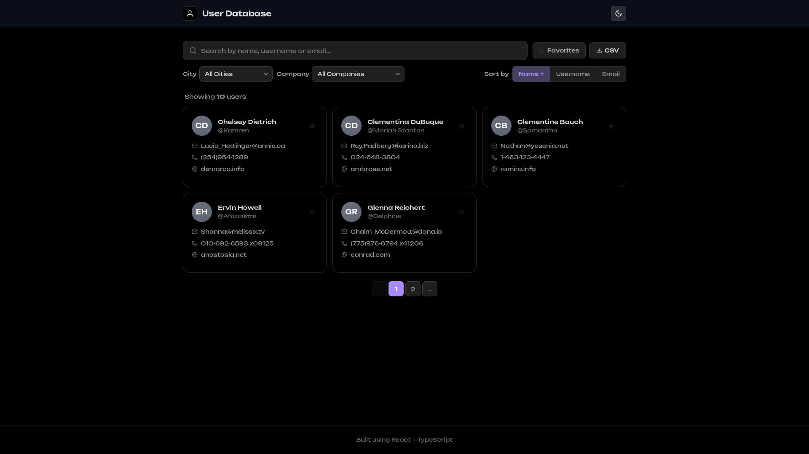
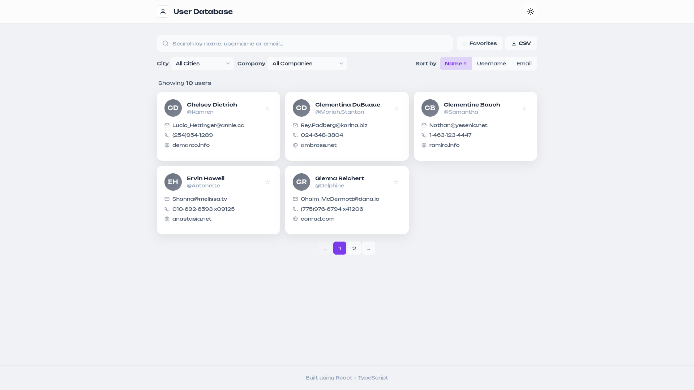
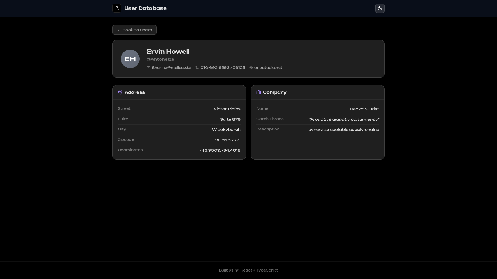
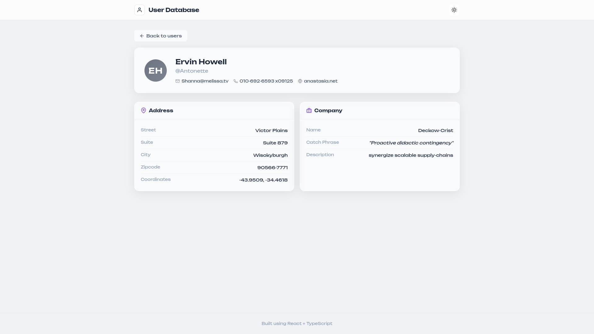

# User Dashboard

A dark-themed user management dashboard built with React, TypeScript, Vite, and Tailwind CSS. Fetches user data from [JSONPlaceholder](https://jsonplaceholder.typicode.com) and provides search, filter, sort, pagination, and favorites functionality.

**Live Demo:** [https://usr-dboard.vercel.app/](https://usr-dboard.vercel.app/)

## Project Overview

This single-page application displays a paginated grid of user cards fetched from the JSONPlaceholder API. Users can:

- Search across name, username, email, phone, and website
- Filter by city and company
- Sort by name, username, or email (ascending / descending)
- Favorite users (persisted to localStorage)
- Toggle between dark and light themes (persisted to localStorage)
- Export the filtered user list to CSV
- View detailed information for each user on a dedicated detail page
- Remove all favorites with one click

The app uses a glassmorphism-inspired dark-first design with a violet accent palette and the Unbounded font from Google Fonts.

## Installation Steps

```bash
# 1. Clone the repository
git clone <repo-url>
cd usr_db

# 2. Install dependencies
npm install

# 3. Start the development server
npm run dev

# 4. Build for production
npm run build
```

The app runs on `http://localhost:5173` by default.

## Available Scripts

| Command | Description |
|---|---|
| `npm run dev` | Start development server |
| `npm run build` | Type-check and build for production |
| `npm run lint` | Run ESLint across the codebase |
| `npm run format` | Format all source files with Prettier |
| `npm run preview` | Preview the production build locally |

## Architecture Explanation

```
usr_db/
├── public/            # Public static assets (favicon)
├── screen_shots/      # Screenshots for README
├── src/
│   ├── assets/        # Static assets
│   ├── components/    # Reusable UI components
│   │   ├── EmptyState.tsx
│   │   ├── ErrorState.tsx
│   │   ├── FilterSection.tsx
│   │   ├── Footer.tsx
│   │   ├── Header.tsx
│   │   ├── Pagination.tsx
│   │   ├── SearchBar.tsx
│   │   ├── SkeletonLoader.tsx
│   │   ├── SortControls.tsx
│   │   └── UserCard.tsx
│   ├── hooks/         # Custom React hooks
│   │   ├── useDebounce.ts
│   │   ├── useFavorites.ts
│   │   ├── useTheme.ts
│   │   └── useUsers.ts
│   ├── pages/         # Route-level page components
│   │   ├── UserDetailPage.tsx
│   │   └── UserListPage.tsx
│   ├── routes/        # Route configuration (lazy-loaded)
│   │   └── index.tsx
│   ├── services/      # API client (Axios -> JSONPlaceholder)
│   │   └── users.ts
│   ├── types/         # TypeScript type definitions
│   │   └── index.ts
│   ├── utils/         # Pure utility functions
│   │   └── userUtils.ts
│   ├── App.tsx        # Root component
│   ├── main.tsx       # Entry point
│   └── index.css      # All styles (global, theme tokens, components)
├── .prettierrc        # Prettier configuration
├── eslint.config.js   # ESLint configuration
├── index.html         # HTML entry point
├── package.json
├── tsconfig.json
├── tsconfig.app.json
├── tsconfig.node.json
└── vite.config.ts
```

**Data flow:** `UserListPage` uses `useUsers` to fetch all users on mount. The raw list is passed through `searchUsers` → `filterUsers` → `sortUsers` → `paginateUsers` (pure functions in `userUtils.ts`). Search is debounced (400ms) via `useDebounce`. Favorites are managed independently through `useFavorites` (localStorage-backed) and applied as a post-filter when the favorites toggle is active.

**Routing:** React Router — `/` renders `UserListPage`, `/users/:id` renders `UserDetailPage`. Routes are defined in `src/routes/index.tsx`. Pages are lazy-loaded with `React.lazy` and wrapped in `<Suspense>`.

**Theming:** `useTheme` reads the initial preference from localStorage (fallback to system `prefers-color-scheme`). Toggling updates a `data-theme` attribute on `<html>`, and CSS custom properties switch accordingly.

## File-by-File Breakdown

### Entry Points

**`main.tsx`** — The React entry point. Mounts `<App />` inside `<React.StrictMode>` to `#root`. Imports `index.css` for all styling.

**`App.tsx`** — Root component. Wraps everything in `<BrowserRouter>` (React Router). Calls `useTheme()` to get theme state, passes it to `<Header>`. Layout: `<Header>` → `<main>` with `<AppRoutes />` → `<Footer>`.

**`index.css`** — All styling lives here. Uses BEM-class-based CSS with `:root` + `[data-theme='light']` defining all theme variables (glass colors, text colors, accent violet, star amber, radii, transitions, gradient backgrounds). BEM blocks for every component. `@keyframes shimmer` + `@keyframes spin` for loading animations. `@media` breakpoints at 1024px, 768px, 640px, 480px for responsive layout. Imports Tailwind but only uses `.sr-only` from it.

### Routing

**`routes/index.tsx`** — Lazy-loads both pages (`UserListPage`, `UserDetailPage`) and wraps them in `<Suspense>` with a spinner fallback. Two routes: `/` (user list) and `/users/:id` (user detail).

### Types

**`types/index.ts`** — Pure TypeScript interfaces mirroring the JSONPlaceholder API shape: `Geo`, `Address`, `Company`, `User`, `SortField`, `SortDirection`, `SortConfig`, `FilterConfig`.

### Services (API Layer)

**`services/users.ts`** — Axios client with a 10-second timeout pointed at `https://jsonplaceholder.typicode.com`. Exposes: `fetchUsers()` (`GET /users`) and `fetchUserById(id)` (`GET /users/{id}`).

### Hooks

**`hooks/useUsers.ts`** — Fetches all users on mount. Returns `{ users, loading, error, retry }`. `retry()` resets and re-fetches on error.

**`hooks/useFavorites.ts`** — Persists favorite user IDs in `localStorage`. `toggleFavorite(id)` adds/removes using functional updater. `isFavorite(id)` checks membership.

**`hooks/useTheme.ts`** — Manages dark/light theme. Initializes from `localStorage`, falls back to `prefers-color-scheme`. Sets `data-theme` attribute on `<html>`.

**`hooks/useDebounce.ts`** — Generic debounce hook (default 400ms). Used to delay search filtering until the user stops typing.

### Pages

**`pages/UserListPage.tsx`** — Main orchestrator page. Renders 5 UI states: error (`<ErrorState>`), loading (`<SkeletonLoader>`), empty (`<EmptyState>` with context-aware messaging), normal (filtered card grid + pagination).

Data pipeline (all memoized): `raw users → debounce → searchUsers() → filterUsers() → sortUsers() → [optional favorites filter] → paginateUsers()`. Top bar: search + favorites toggle + CSV export. Bottom bar: city/company filters + sort buttons.

**`pages/UserDetailPage.tsx`** — Reads `:id` from URL, fetches single user via `fetchUserById()`. Uses cancelled-flag pattern to prevent state updates on unmounted component. Shows: back link → hero section (avatar + name + email/phone/website) → 2-column grid with Address card and Company card.

### Components

**`Header.tsx`** — Sticky header with B/W person SVG icon + "User Database" title on the left, B/W theme toggle button (sun/moon SVGs) on the right. Uses `.header`, `.theme-toggle` BEM classes.

**`Footer.tsx`** — Centered footer with "Built using React + TypeScript" text.

**`UserCard.tsx`** — `memo`ized card for each user. Gray gradient avatar with initials, name + @username, star toggle (★/☆), email/phone/website with SVG icons. Click navigates to `/users/{id}`. Star button uses `stopPropagation`.

**`SearchBar.tsx`** — Search input with magnifier icon on the left, clear × button on the right (visible only when value is non-empty). Focus accent glow via `:focus-within`.

**`FilterSection.tsx`** — Two `<select>` dropdowns (City, Company) populated from unique values. Default to "All".

**`SortControls.tsx`** — Button group: Name | Username | Email. Click active button toggles asc/desc (↑↓). Inactive buttons set that field ascending.

**`Pagination.tsx`** — `memo`ized. Ellipsis logic for >7 pages. ←/→ disabled at boundaries. Active page has accent background. Returns `null` when `totalPages <= 1`.

**`SkeletonLoader.tsx`** — Animated shimmer skeleton cards matching the card grid layout. Avatar circle + text lines with CSS-only `@keyframes shimmer`.

**`EmptyState.tsx`** — Context-aware empty messaging: "No favorites yet" vs "No users found". "Clear filters" button.

**`ErrorState.tsx`** — Error message + "Try Again" button. Uses `role="alert"`.

### Utilities

**`utils/userUtils.ts`** — Pure functions: `searchUsers` (filters by name/username/email), `sortUsers` (copies + sorts), `filterUsers` (matches city AND company), `paginateUsers` (slice for current page), `exportToCSV` (triggers browser download), `getUniqueCities` / `getUniqueCompanies` (for filter dropdowns).

### Data Flow Summary

```
Browser URL
  ↓
main.tsx → App.tsx
  │          ├── useTheme() → { theme, toggleTheme }
  │          ├── <Header theme toggleTheme />
  │          └── <AppRoutes />   ← React Router
  │                ├── / → UserListPage
  │                │      ├── useUsers() → fetchUsers() [Axios → jsonplaceholder]
  │                │      ├── useFavorites() → localStorage
  │                │      ├── useDebounce(searchQuery)
  │                │      ├── userUtils: search → filter → sort → paginate
  │                │      ├── SearchBar → FilterSection → SortControls
  │                │      ├── UserCard → UserDetailPage (click)
  │                │      └── Pagination
  │                └── /users/:id → UserDetailPage
  │                       ├── useParams() → fetchUserById(id)
  │                       ├── Loading/Error/User states
  │                       └── Back link → /
  └── <Footer />

index.css: BEM classes + CSS vars + Tailwind (sr-only only)
```

## Screenshots

Home page (dark mode) — user card grid with search, filters, sort, and favorites toggle.


Home page (light mode).


User detail page (dark mode) — avatar, info, address, and company sections.


User detail page (light mode).


## Testing Instructions

This project does not include automated tests. The test directory and Jest dependencies were removed per project constraints.

To manually verify the app:

1. Run `npm run dev` and open in a browser
2. Confirm the user list loads from the JSONPlaceholder API
3. Test search with various queries (name, email, phone, etc.)
4. Test city and company filters
5. Test sort toggles (ascending / descending / none)
6. Click the star icon on cards to favorite/unfavorite users
7. Enable the "Favorites only" toggle to verify filtering
8. Change the page via pagination controls
9. Click a user card to navigate to the detail page
10. Toggle dark/light theme and verify persistence on reload
11. Click the CSV export button and verify the downloaded file

## Performance Optimizations Implemented

- **Debounced search** (400ms) to reduce filtering work while typing
- **All filtering, sorting, and pagination done client-side** on a single API call (only 10 users, so no server round-trips)
- **React.lazy + Suspense** for code-splitting the detail page bundle
- **CSS custom properties** for theming (no re-renders on theme switch — single DOM attribute change)
- **Tailwind CSS utility classes** alongside custom CSS for efficient styling
- **localStorage writes** only happen on explicit favorite/theme toggle (not on every render)
- **Pure functions** in `userUtils.ts` are side-effect-free and trivially testable/reusable

## Assumptions Made

- **JSONPlaceholder is always available** — no fallback data or caching layer is implemented. If the API is down, `ErrorState` is shown with a retry button.
- **The dataset is small (10 users)** — all users are fetched in one request. No lazy loading, virtual scrolling, or server-side pagination is needed.
- **No authentication or authorization** — the app is fully public and client-side only.
- **localStorage is available** — favorites and theme preferences depend on it. If unavailable (private browsing restrictions), features degrade silently with defaults (empty favorites, dark theme).
- **No backend** — all data comes from JSONPlaceholder. No mutations (create/update/delete) are supported.
